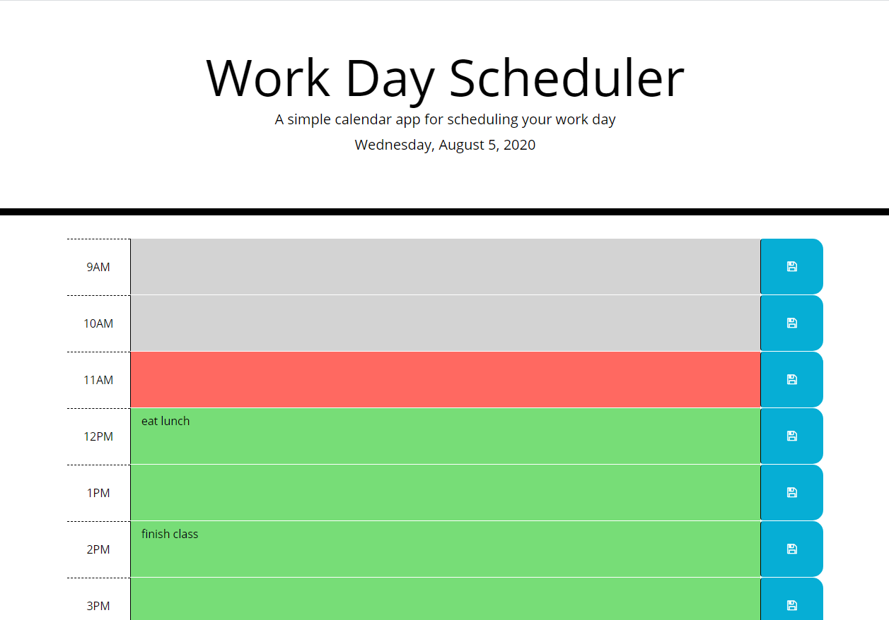

# 05 Third-Party APIs: Work Day Scheduler
A work day planning web application.

https://rebgrasshopper.github.io/dailyplanner/

Table of Contents:

- [Section 1: Introduction](#introduction)
- [Section 2: Usage](#usage)
- [Section 3: Credits](#credits)
- [Section 4: License](#license)

## Introduction ##

This project can be accessed from any browser on an internet-connected device. It is a simple work calendar featuring dynamically updated HTML and CSS powered by jQuery, with dates from moment.js. It contains textareas which autosave as the user types. The textarea values save to local storage and automatically load upon page initialization.

## Usage ##

The source files for this quiz can be accessed through cloning the GitHub repo. The link above will take you to the deployed project.

## Credits ##

Thanks to my coding co-op, and you can catch some of 'em here:

- [Zachary Bryan](https://github.com/zacharybryan)
- [Tim Sanders](https://github.com/tbsanders5)
- [Nick Konzen](https://github.com/NTKonzen)
- [Kira Bismuth Lowrey](https://github.com/KILowrey)
- [Nancy Lambert-Brown](https://github.com/n-lambert)
- [Mando Estrada](https://github.com/Mando619)
- [Talia Vazquez](https://github.com/taliavazquez)
- [Perry Theobald](https://github.com/perrytjr)
- [Jeneth Diestra](https://github.com/jen6one9)
- [Matthew Rogers](https://github.com/Rogers-Development-Services)
- [Jefrrey Choi](https://github.com/jepoy92)
- [Clyde Baron Rapinan](https://github.com/clydebaron2000)
- [Johnny Lieu](https://github.com/johnnylieu)
- [Robert Graham](https://github.com/Robmgraham)

## License ##

GNU General Public License